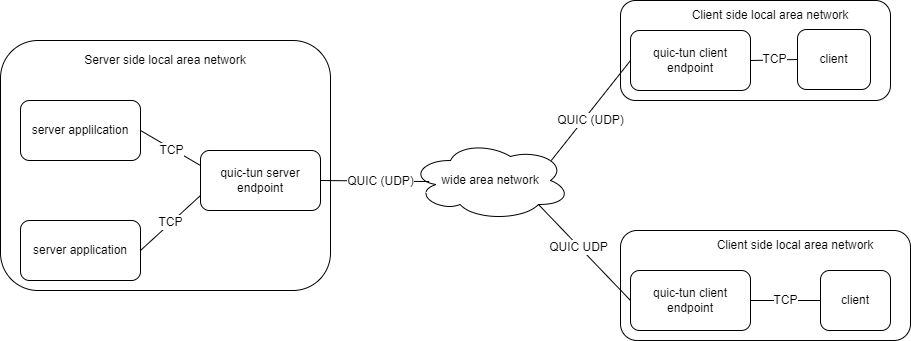

# quic-tun

[![Release][1]][2] [![MIT licensed][3]][4]

[1]: https://img.shields.io/github/v/release/kungze/quic-tun?color=orange
[2]: https://github.com/kungze/quic-tun/releases/latest
[3]: https://img.shields.io/github/license/kungze/quic-tun
[4]: LICENSE

Establish a fast&security tunnel, make you can access remote TCP/UNIX
application like local application.

[中文文档](https://kungze.github.io/documents/quic-tun)

## Overview

``Quic-tun`` contains two command tools: ``quictun-server`` and ``quictun-client``,
``quictun-server`` used to translate application's transport layer protocol from
TCP/UNIX to [QUIC](https://en.wikipedia.org/wiki/QUIC), and ``quictun-client``
translate back to TCP/UNIX protocol at client side. The schematic diagram like below:



### Performance

We wrote a [test report](docs/test-report/) about the difference of performance between transport
packets by TCP directly and transport packets by `quic-tun`. If you want to know more informations,
please consult it.

### Concerned issues

If you are hesitating whether or not to study this document deeply or to play
attention to this project. Maybe the below issues will help you to make your decision.

* Whether you often encounter packet loss or high latency issues? And this issues influenced
  your application's performance or stabililty.
* You have multiple applications and listen on multiple ports, but you don't want expose
  too much ports to internet.
* Your application don't support TLS but the security issue is your concerned thing.
* Your application listen on local UNIX socket, but you need to access it at other machines.

If you encounter one or more above scenarios. Congratulations, you find the correct place!

## QuickStart

Increase the maximum buffer size, read the
[docs](https://github.com/lucas-clemente/quic-go/wiki/UDP-Receive-Buffer-Size) for details

```shell
sysctl -w net.core.rmem_max=2500000
```

Download a corresponding one from precompiled from [releases](https://github.com/kungze/quic-tun/releases) and decompression it.

```shell
wget https://github.com/kungze/quic-tun/releases/download/v0.0.1/quic-tun_0.0.1_linux_amd64.tar.gz
```

```shell
tar xvfz quic-tun_0.0.1_linux_amd64.tar.gz
```

Start up server side endpoint

```console
./quictun-server --listen-on 172.18.31.36:7500
```

Start up client side endpoint

```console
./quictun-client --listen-on tcp:127.0.0.1:6500 --server-endpoint 172.18.31.36:7500 --token-source tcp:172.18.30.117:22
```

**Note:** The value specified by `--token-source` used to tell `quictun-server` the application address that the client want to access.

Use `ssh` command to test

```console
$ ssh root@127.0.0.1 -p 6500
root@127.0.0.1's password:
```

## Concepts

* **client endpoint:** A service run on client side, used to accept the client applications' connection request and convert the transport layer protocol from TCP/UNIX-SOCKET to QUIC.
* **server endpoint:** A service run on server side, used to accept the data from client endpoint and forward these data to server application by TCP/UNIX-SOCKET protocol.
* **token:** When a client endpoint receive a new connection request, the client endpoint will retrieve a token according to the request's source address and send the token to server endpoint, the server endpoint will parse and verify the token and get the server application socket address from parsed result. ``quic-tun`` provide multiple type token plugin in order to adapt different use cases.
* **tunnel** ``quic-tun`` will create a tunnel for each TCP/UNIX-SOCKET connection, one tunnel corresponding with one QUIC stream.

## Token plugin

### quictun-client

At client side, We address the token plugin as token source plugin, related command options ``--token-source-plugin``, ``--token-source``. Currently, ``quic-tun`` provide three type token source plugin: ``Fixed``, ``File`` and ``Http``.

#### Fixed

``Fixed`` token source plugin always provide one same token, this mean that all of client applications just only connect to one fixed server application.

Example:

```console
./quictun-client --listen-on tcp:127.0.0.1:6500 --server-endpoint 172.18.31.36:7500 --token-source-plugin Fixed --token-source tcp:172.18.30.117:22
```

#### File

``File`` token source plugin will read token from a file and return different token according to the client application's source address. The file path specified by ``--token-source``.

The file's contents like below:

```text
172.26.106.191 tcp:10.20.30.5:2256
172.26.106.192 tcp:10.20.30.6:3306
172.26.106.193 tcp:10.20.30.6:3306
```

The first column are the client application's IP addresses, the second column are the token(The server application's socket addresses which the client application want to access.)

Example:

```console
./quictun-client --server-endpoint 127.0.0.1:7500 --token-source-plugin File --token-source /etc/quictun/tokenfile --listen-on tcp:172.18.31.36:6622
```

#### Http

``Http`` token source plugin will get the token based on the URL configured by ``--token-source``.

The ``Http`` token source plugin is requested as follows.

```text
http://172.18.31.36:8081/get?addr=192.168.110.116:61313
```

The ``--token-source`` should return data in the following format.

```json
{
  "token": "tcp:172.27.130.202:5913"
}
```

Example:

```console
./quictun-client --listen-on tcp:127.0.0.1:6500 --server-endpoint 172.18.31.36:7500 --token-source-plugin Http --token-source http://172.18.31.36:8081/get
```

### quictun-server

At server side, we address the token plugin as token parser plugin, it used to parse and verify the token and get the server application socket address from the parse result, related command option ``--token-parser-plugin``, ``--token-parser-key``. Currently, ``quic-tun`` just provide one token parser plugin: ``Cleartext``.

#### Cleartext

``Cleartext`` token parser plugin require the token mustn't be encrypted. But you can use ``base64`` to encode token.

Example:

If the client endpoint token is not encoded.

```console
./quictun-server --listen-on 172.18.31.36:7500 --token-parser-plugin Cleartext
```

If the client endpoint token is encoded by ``base64``

```console
./quictun-server --listen-on 172.18.31.36:7500 --token-parser-plugin Cleartext --token-parser-key base64
```

## Restful API

``quic-tun`` also provide some restful API. By these APIs, you can query the information of the tunnels which are active.
You can set address of the API server listen on by ``--httpd-listen-on`` when you start server/client endpoint server, like below:

```console
./quictun-server --httpd-listen-on 127.0.0.1:18086
```

Then you can use ``curl`` command to query all active tunnels, like below:

```console
$ curl http://127.0.0.1:18086/tunnels | jq .
  % Total    % Received % Xferd  Average Speed   Time    Time     Time  Current
                                 Dload  Upload   Total   Spent    Left  Speed
100   227  100   227    0     0   221k      0 --:--:-- --:--:-- --:--:--  221k
[
  {
    "uuid": "2e1ce596-8357-4a46-aef1-0c4871b893cd",
    "streamId": 4,
    "endpoint": "server",
    "serverAppAddr": "172.18.31.97:22",
    "remoteEndpointAddr": "172.18.29.161:46706",
    "createdAt": "2022-06-21 11:44:05.074778434 +0800 CST m=+86.092908233",
    "protocol": "",
    "protocolProperties": null
  }
]
```

Additionally, we implement a [Spice protocol](https://www.spice-space.org/spice-protocol.html) discriminator,
it can extract more properties about spice from the traffic pass through the tunnel. So, for spice application,
call the query API, you can get the below response:

```console
# curl http://172.18.29.161:18086/tunnels | jq .
  % Total    % Received % Xferd  Average Speed   Time    Time     Time  Current
                                 Dload  Upload   Total   Spent    Left  Speed
100  5137    0  5137    0     0  2508k      0 --:--:-- --:--:-- --:--:-- 5016k
[
  {
    "uuid": "9eb73491-ef38-463d-85c3-d4512152d224",
    "streamId": 0,
    "endpoint": "server",
    "serverAppAddr": "172.18.11.2:5915",
    "remoteEndpointAddr": "172.18.29.161:56465",
    "createdAt": "2022-06-21 11:41:28.85774404 +0800 CST m=+47.535828999",
    "protocol": "spice",
    "protocolProperties": {
      "version": "2.2",
      "sessionId": "d0306d75",
      "channelType": "main",
      "serverName": "instance-e548a827-8937-4047-a756-e56937017128",
      "serverUUID": "e548a827-8937-4047-a756-e56937017128"
    }
  },
  {
    "uuid": "66bad84d-318c-4e14-b3be-a5cb796e7f61",
    "streamId": 44,
    "endpoint": "server",
    "serverAppAddr": "172.18.11.2:5915",
    "remoteEndpointAddr": "172.18.29.161:56465",
    "createdAt": "2022-06-21 11:41:28.937090895 +0800 CST m=+47.615175866",
    "protocol": "spice",
    "protocolProperties": {
      "version": "2.2",
      "sessionId": "d0306d75",
      "channelType": "record"
    }
  },
  {
    "uuid": "ff93728e-38fb-435c-8728-3ece51077b95",
    "streamId": 56,
    "endpoint": "server",
    "serverAppAddr": "172.18.11.2:5915",
    "remoteEndpointAddr": "172.18.29.161:56465",
    "createdAt": "2022-06-21 11:41:29.224234488 +0800 CST m=+47.902319441",
    "protocol": "spice",
    "protocolProperties": {
      "version": "2.2",
      "sessionId": "d0306d75",
      "channelType": "inputs"
    }
  },
  {
    "uuid": "fbfd963c-e6b9-4c13-bfec-8965b1c56851",
    "streamId": 12,
    "endpoint": "server",
    "serverAppAddr": "172.18.11.2:5915",
    "remoteEndpointAddr": "172.18.29.161:56465",
    "createdAt": "2022-06-21 11:41:28.93269002 +0800 CST m=+47.610774997",
    "protocol": "spice",
    "protocolProperties": {
      "version": "2.2",
      "sessionId": "d0306d75",
      "channelType": "usbredir"
    }
  },
  {
    "uuid": "62fa355c-9c0d-4dbb-9e84-2b0c354cf8cc",
    "streamId": 48,
    "endpoint": "server",
    "serverAppAddr": "172.18.11.2:5915",
    "remoteEndpointAddr": "172.18.29.161:56465",
    "createdAt": "2022-06-21 11:41:28.937563866 +0800 CST m=+47.615648836",
    "protocol": "spice",
    "protocolProperties": {
      "version": "2.2",
      "sessionId": "d0306d75",
      "channelType": "display"
    }
  },
  {
    "uuid": "ce2e0bef-0ccb-4325-ab65-a6d3783c47ae",
    "streamId": 52,
    "endpoint": "server",
    "serverAppAddr": "172.18.11.2:5915",
    "remoteEndpointAddr": "172.18.29.161:56465",
    "createdAt": "2022-06-21 11:41:29.223947759 +0800 CST m=+47.902032695",
    "protocol": "spice",
    "protocolProperties": {
      "version": "2.2",
      "sessionId": "d0306d75",
      "channelType": "cursor"
    }
  },
  {
    "uuid": "c5169c4a-ab69-406b-b36a-68c0ab7d9d7f",
    "streamId": 40,
    "endpoint": "server",
    "serverAppAddr": "172.18.11.2:5915",
    "remoteEndpointAddr": "172.18.29.161:56465",
    "createdAt": "2022-06-21 11:41:28.936673702 +0800 CST m=+47.614758657",
    "protocol": "spice",
    "protocolProperties": {
      "version": "2.2",
      "sessionId": "d0306d75",
      "channelType": "playback"
    }
  }
]
```
