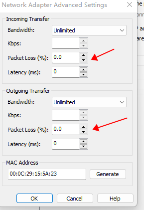

# Performance test

For verify the effect of `quic-tun` in network performance, I make some tests and wrote
this report.

The following three metrics should be focused during testing: Network Bandwidth, Network Latency, CPU usage. We
will compare the these performance metrics between transport traffic directly by TCP and transport traffic by
`quic-tun`. We will also make different packet loss rate network environment.

## Test environment and tools

* Two local vmware workstation virtual machines, One as server machine, anthor one as client machine.
* One remote machine that can be access by public network, used to test network latency in WAN.
* Operating-system: ubuntu 20.02
* Network Bandwidth test tools: iperf3
* Use `top` command to watch the CPU useage

Additionally, I haven't find good tool to test Network Latency. So, I use python wrote a [test tool](../../tests/latency/README.md) myself.

## How to set the packet loss rate

VMware workstation support set the packet loss rate for a specified virtual machine, like below:

In all test cases, I just change the client machine's packet loss rate, moreover the
incoming packet loss rate and outgoing packet loss rate are same. The server machine
don't set packet loss rate.

## Test results

* [Network Bandwidth and CPU Usage](bandwidth.md)
* [Network Latency](latency.md)
