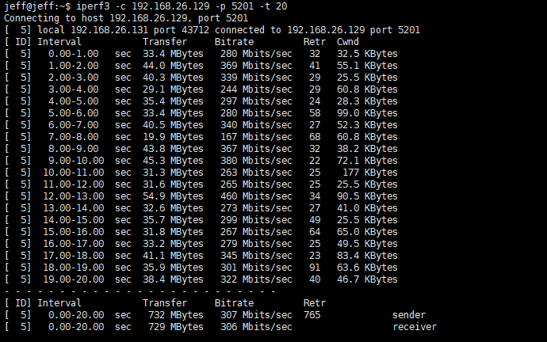

# Network Bandwidth and CPU Usage Test

## Preparation

* In server machine:

  Start iperf3 server

  ```console
  $ iperf3 -s
  -----------------------------------------------------------
  Server listening on 5201
  -----------------------------------------------------------
  ```

  Open a new terminal, start `quictun-server`:

  ```console
  $ ./quictun-server
  I0624 09:15:29.223140    1515 server.go:30] "Server endpoint start up successful" listen address="[::]:7500"
  ```

* In client machine

  Start `quictun-client`

  ```console
  $ ./quictun-client --server-endpoint 192.168.26.129:7500 --token-source tcp:127.0.0.1:5201 --insecure-skip-verify true
  I0624 09:17:30.926905    1679 client.go:35] "Client endpoint start up successful" listen address="127.0.0.1:6500"
  ```

  The `192.168.26.129` is the server machine's IP address.

  Open a new terminal, execute `iperf3 -c` command to start test:

  * Test the performance by TCP directly:

    ```console
    iperf3 -c 192.168.26.129 -p 5201 -t 20
    ```

  * Test the performance by `quic-tun` forward the traffic:

    ```console
    iperf3 -c 127.0.0.1 -p 6500 -t 20
    ```

  Open a new terminal, execute `top` command to watch the CPU usage:

  ```console
  top
  ```

## Test results

For show results more clearly, I just only remain the client machine's screenshots,
That's enough for us.

### Packet loss rate: 0.0%

* TCP

  
  

* quic-tun

  
  

### Packet loss rate: 0.1%

* TCP

  
  

* quic-tun

  
  

### Packet loss rate: 0.5%

* TCP

  
  

* quic-tun

  
  

### Packet loss rate: 1.0%

* TCP

  
  

* quic-tun

  
  

### Packet loss rate: 5.0%

* TCP

  
  

* quic-tun

  
  

### Summarize Table

* TCP

|packet loss rate(%)|sender bitRate(Mbits/sec)|reveiver bitRate(Mbits/sec)|CPU(ksoftirqd)|
|:------------------|:-----|:-----|:-----|
| 0  |  562 | 561 |  18.7 |
| 0.1 | 307 | 306 | 10.0 |
| 0.5 | 80.2 | 79.9 | 1.0 |
| 1 |60.7 | 60.3 | 2.0 |
| 5 |13.0 | 12.8 | 1.3 |

* quic-tun

|packet loss rate(%)|sender bitRate(Mbits/sec)|reveiver bitRate(Mbits/sec)|CPU(ksoftirqd)|CPU(quictun-client)|
|:------------------|:-----|:-----|:-----|:-----|
| 0 | 604 | 601 | 2.7 | 75.1 |
| 0.1 | 348 | 344 | 2.0  | 66.3 |
| 0.5 | 239 | 235 | 1.0 | 49.8 |
| 1 | 138 | 135 | 1.0 | 35.7 |
| 5 | 38.8 | 36.4 | 1.3 | 22.9 |

## CPU flame graph

In order to analy that why the `quictun` CPU usage is so high, especially when the traffic is high. I draw a CPU flame graph.


By above graph, we can find that the `udp_sendmsg` occupy vast CPU. I look up some documents on
internet find the below document maybe useful for decrease the CPU usage, but I haven't learn it
in deep yet.

https://conferences.sigcomm.org/sigcomm/2020/files/slides/epiq/0%20QUIC%20and%20HTTP_3%20CPU%20Performance.pdf
